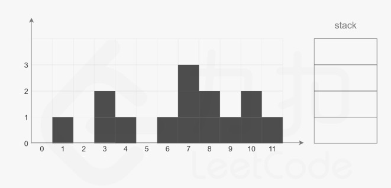
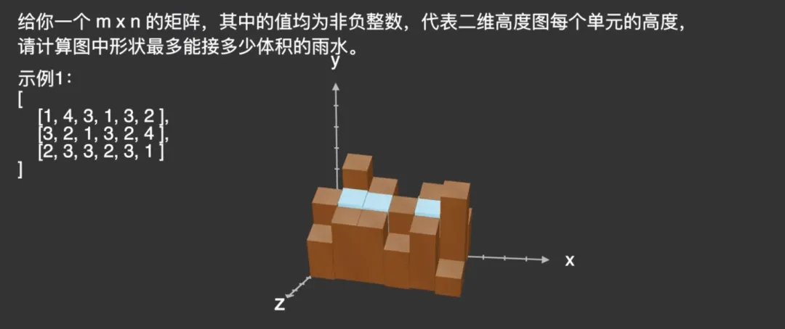

# AlgorithmicProblem

===

===
> 记录些有意思的算法问题。 
> Some interesting algorithm problems.

## [problem_1](/problem_1/)

* 题目：2D接雨滴
* 解法：最小堆
* 时间复杂度：O(log(MN))

代码实现

* [`raindrop_3d.c`](/problem_1/c/raindrop_2d.c)
* [`TrappingRainWaterII.java`](/problem_1/java/raindrop_2d.java)
  

## [problem_2](/problem_2/)

* 题目：3D接雨滴
* 解法：优先队列
* 时间复杂度：O(MNlog(MN))

代码实现

* [`raindrop_3d.c`](/problem_2/c/raindrop_3d.c)
* [`TrappingRainWaterII.java`](/problem_2/java/raindrop_3d.java)
  

## Contact Me
* E-mail: niyongsheng@Outlook.com
* Weibo: [@Ni永胜](https://weibo.com/u/7317805089)
